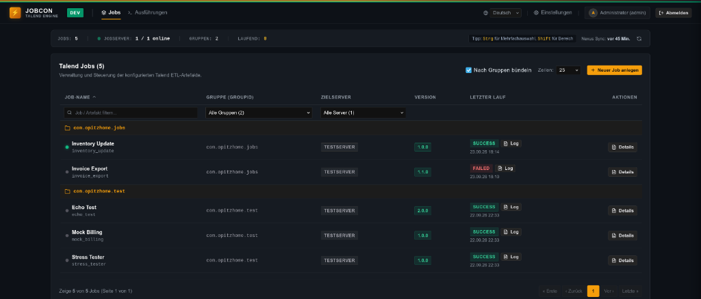

# JobCon – Lightweight Job Deployment & Execution Engine

[English](README.md) | **Deutsch**

JobCon ist eine leichtgewichtige, performante und Linux-native Deployment- und Execution-Engine für versionierte Jobs auf Zielservern.

Ursprünglich als moderner, schlanker Ersatz für das **Talend Administration Center (TAC) / Job Conductor** konzipiert, entwickelt sich JobCon kontinuierlich zu einer universellen Steuerzentrale für beliebige Batch-, ETL- und Hintergrundjobs (z. B. Talend, Python, Bash-Skripte oder native Linux-Binaries). Aktuell ist als Artefakt-Transportmittel primär **Sonatype Nexus** (Maven ZIP-Archive) angebunden; die modulare Struktur bereitet jedoch bereits den Weg für künftige Repository-Alternativen wie **Git Releases** vor.



## Kernmerkmale

* **Single-Binary & Container-Ready:** Entwickelt in reiner Go-Standardbibliothek + CGO-freiem SQLite (`modernc.org/sqlite`). Keine Java-, Node- oder Python-Laufzeitabhängigkeiten auf dem JobCon-Host.
* **Entkopplung von Deployment & Execution:**
  * **Deployment & Undeployment:** Download aus Nexus, versionierte Ablage (`releases/{version}`), atomares Umschalten des Symlinks `current` sowie sauberes Undeployen/Entfernen von Zielservern.
  * **Execution:** Lokaler Start ohne TAC-Overhead via schlanke Starter-Skripte für **JS7 / SOS JobScheduler**, Cron oder über JobCon SSH-Runner.
  * **Deployment-Status:** Direkte Visualisierung (grüner/grauer Statuspunkt), ob Jobs auf den Zielservern bereitgestellt sind.
* **Sicherheit & Secret-Schutz:**
  * **AES-256-GCM Verschlüsselung:** Sensible Zugangsdaten (Nexus-Passwort, LDAP Bind-Passwort) werden vor dem Speichern in der SQLite-Datenbank transparent mit AES-256-GCM verschlüsselt.
  * **Master Encryption Key & Dateirechte (0600):** Der kryptografische Master-Schlüssel wird in `config.yaml` (`security.encryption_key`) konfiguriert (Generierung via `openssl rand -hex 32`). JobCon erzwingt beim Start automatisch strenge Zugriffsrechte (`0600`, nur Owner lesbar/schreibbar) auf `config.yaml`.
  * **Keine Passwörter in SSH-Prozessen:** Passwörter werden niemals in SSH-Befehlen oder Prozesslisten (`ps aux`) übertragen. JobCon legt beim Server-Setup eine versteckte Datei `<scripts_dir>/.nexus_auth` mit `0600`-Rechten auf dem Zielserver an, aus der `jobcon_ctl.sh` Anmeldedaten lokal liest.
  * **SSH Host-Key Pinning (TOFU):** Schutz vor Man-in-the-Middle-Angriffen durch Trust-On-First-Use Pinning des Host-Keys in der Datenbank.
  * **Rollenbasiertes Rechtesystem (RBAC):** Benutzerverwaltung mit `bcrypt`-Hashing und Rollen (`admin`, `operator`, `viewer`), Schutz des letzten Administrators vor Löschung/Deaktivierung.
  * **Authentifizierung:** HTTP BasicAuth, Session-Cookies und integrierter LDAP / Active Directory Support.
* **Externe Zielserver-Skripte:** Skripte (`jobcon_ctl.sh`, `run_job.sh`) sind **vollständig extern** im Verzeichnis `./scripts/` ausgelagert und nicht im Binary fest einkompiliert. Sie können ad-hoc angepasst oder für alternative Job-Typen erweitert werden.
* **Multi-Job Steuerung (Bulk Actions):**
  * Komfortable Mehrfachauswahl via Klick, Shift+Klick (Bereich) und Strg/Cmd+Klick (Toggle) ganz ohne Checkboxen.
  * Bulk-Aktionsleiste für Direktausführung (`▶ Start` ohne Modal-Popup), Deployment (`🚀 Deploy`) und Undeployment (`🗑️ Undeploy`).
  * Dedizierter „Details“-Button zum Öffnen des Sidepanels.
* **High-Density UI & Nexus Cache:**
  * Kompaktes Statusband im Kopfbereich (Jobs, Online-Server mit Puls-Dot, Gruppen, aktive Läufe, Nexus Sync-Status).
  * Lokaler SQLite-Cache für Nexus-Artefakte mit schnellem In-Memory-Picker (< 5ms) und periodischer Hintergrundsynchronisation.
  * Queue-Worker-Pool zur Begrenzung paralleler Job-Ausführungen (`max_concurrent_jobs`).
* **Umgebungs-Kennzeichnung (Environment Badge):** Konfigurierbare Anzeige der Umgebung (z. B. `DEV`, `TEST`, `PROD`) inklusive Farbakzentstreifen im UI.
* **Mehrsprachigkeit (i18n):** Native Unterstützung für Englisch und Deutsch, umschaltbar im Header und benutzerbezogen gespeichert.
* **Umgebungsvariablen (.env):** Automatisches Sourcing von `.env`-Dateien auf Zielsystemen pro Server oder individuell pro Job.
* **Echtzeit-Transparenz:** Live-Streaming von `stdout` und `stderr` via Server-Sent Events (SSE) in ein schlankes Web-Terminal.
* **CI/CD Integration (Jenkins):** REST-API mit API-Bearer-Tokens und blockierender Ausführung (`?wait=true`) als moderner MetaServlet-Ersatz.

---

## Bereitstellung & Schnellstart

JobCon kann wahlweise via **Docker Compose**, als **Systemd-Service auf Linux** oder direkt als **Single-Binary** betrieben werden.

### Option A: Docker Compose (Empfohlen)

JobCon läuft in einem gehärteten Container basierend auf **Debian 13 (Trixie Slim)** unter dem Non-Root User `jobcon` (UID 1000).

1. Konfiguration vorbereiten:
   ```bash
   cp config.example.yaml config.yaml
   # Master-Schlüssel generieren und eintragen:
   openssl rand -hex 32
   chmod 0600 config.yaml
   ```

2. Container starten:
   ```bash
   docker compose up -d
   ```

3. Logs einsehen:
   ```bash
   docker compose logs -f
   ```

* **Persistenz:** Datenbank und Logs werden unter `./data` gespeichert.
* **Externe Skripte:** Das Verzeichnis `./scripts/` ist als Volume gemountet. Änderungen an den Server-Skripten werden sofort ohne Container-Neubau wirksam!

---

### Option B: Build & Deployment via `target/` Verzeichnis

Das Build-Skript erzeugt eine saubere, sofort verteilbare Distributionsstruktur:

```bash
make build
# oder: ./build.sh
```

Das erstellte Verzeichnis `target/` enthält:
* `jobcon`: Statisch gelinktes Linux-Binary.
* `scripts/`: Externe Zielserver-Skripte (`jobcon_ctl.sh`, `run_job.sh`).
* `config.example.yaml`: Beispiel-Konfiguration.
* `jobcon.service`: Systemd-Service-Unit für Linux/Debian.
* `jobcon-linux-amd64.tar.gz` / `.zip`: Distributionsarchive.

#### Installation als Systemd-Service:
```bash
sudo cp -r target/* /opt/jobcon/
sudo useradd -r -s /bin/false -d /opt/jobcon jobcon || true
sudo chown -R jobcon:jobcon /opt/jobcon
sudo chmod 0600 /opt/jobcon/config.yaml
sudo cp /opt/jobcon/jobcon.service /etc/systemd/system/
sudo systemctl daemon-reload
sudo systemctl enable --now jobcon
```

---

## Externe Zielserver-Skripte

Die Skripte für Zielserver liegen extern im Verzeichnis `./scripts/` und werden **nicht** in das Binary einkompiliert:

1. **`jobcon_ctl.sh`** (Universal-Controller auf dem Zielserver):
   * Deployt Releases nach `/opt/talend/jobs/{job_name}/releases/{version}`.
   * Rotiert atomar die Symlinks (`current`, `current-1`, etc.).
   * Bereinigt unverlinkte Versionen anhand der Retention-Policy.
   * Liest Nexus-Zugangsdaten sicher aus `/opt/talend/scripts/.nexus_auth` (0600).
   * Bindet `.env`-Dateien ein und startet den Job in einer eigenen Prozessgruppe (`setsid`).
2. **`run_job.sh`** (Schlanker Starter für JS7 / SOS JobScheduler oder Cron):
   * Führt das jeweils aktive Release direkt lokal aus:
     ```bash
     /opt/talend/scripts/run_job.sh <job_name> [optionale params...]
     ```

Beim Einrichten eines Servers über die Web-UI („Scripte bereitstellen“) oder API überträgt JobCon automatisch alle `.sh`-Skripte sowie die verschlüsselt hinterlegte `.nexus_auth` per SSH auf den Zielserver.

---

## REST-API Übersicht

Alle API-Aufrufe erfordern Authentifizierung via `Authorization: Bearer <TOKEN>` oder HTTP BasicAuth.

| Methode | Endpunkt | Beschreibung |
| :--- | :--- | :--- |
| `GET` | `/healthz` | Health-Check (ohne Auth) |
| `GET` | `/api/v1/jobs` | Liste aller Jobs |
| `POST` | `/api/v1/jobs` | Neuen Job anlegen (Admin) |
| `DELETE` | `/api/v1/jobs/{id}` | Job löschen (optional `?undeploy=true`) |
| `POST` | `/api/v1/jobs/{id}/deploy` | Version auf Zielserver installieren |
| `POST` | `/api/v1/jobs/{id}/undeploy` | Job vom Zielserver entfernen |
| `POST` | `/api/v1/jobs/{id}/run` | Job starten (optional mit `?wait=true`) |
| `POST` | `/api/v1/jobs/bulk/run` | Mehrere Jobs gleichzeitig starten |
| `POST` | `/api/v1/jobs/bulk/deploy` | Mehrere Jobs gleichzeitig deployen |
| `POST` | `/api/v1/jobs/bulk/undeploy` | Mehrere Jobs gleichzeitig undeployen |
| `GET` | `/api/v1/nexus/artifacts` | Gecachte Nexus-Artefakte abfragen |
| `POST` | `/api/v1/nexus/sync` | Sofortige Hintergrund-Synchronisation auslösen |
| `GET` | `/api/v1/jobs/{id}/artifact` | Nexus Download-URL und Metadaten |
| `GET` | `/api/v1/executions` | Ausführungshistorie |
| `GET` | `/api/v1/executions/{id}/logs` | Logs als Plain-Text oder SSE |
| `POST` | `/api/v1/executions/{id}/abort` | Laufende Ausführung abbrechen |
| `POST` | `/api/v1/servers/{id}/test` | SSH-Verbindung zum Zielserver prüfen |

### Beispiel: Jenkins Pipeline Aufruf (Blocking)
```bash
curl -X POST "http://jobcon:8080/api/v1/jobs/sync_sap/run?wait=true" \
     -H "Authorization: Bearer ${JOBCON_TOKEN}" \
     -H "Content-Type: application/json" \
     -d '{"context": "Production", "params": {"batchSize": "1000"}}'
```

---

## Hinweis zur Entwicklung

Dieses Projekt wurde mit Unterstützung von Künstlicher Intelligenz (KI) entwickelt.

---

## Lizenz

Dieses Projekt ist unter der [GNU General Public License v3.0](LICENSE) lizenziert.
